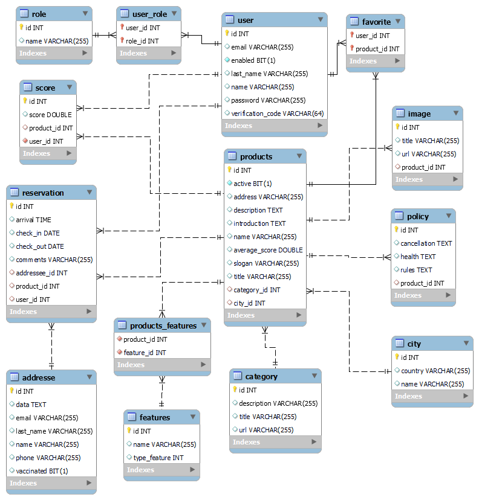
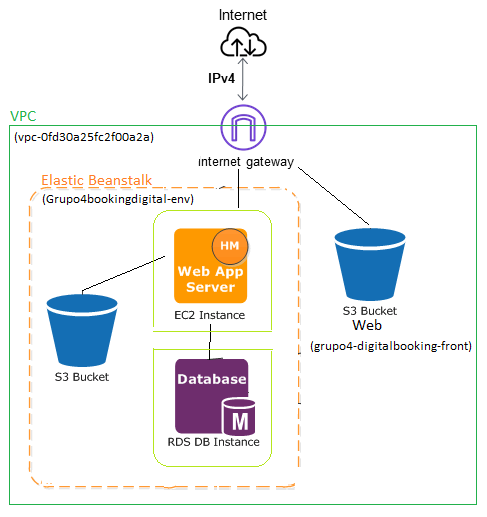

# DigitalBooking

Enlace habilitado desde 14:00hs a 18:00hs (UTC-3)  
✈ http://app-digital-booking.s3-website-us-east-1.amazonaws.com/ ✈

## Resumen

El proyecto consiste en el desarrollo web de una app completa desde principio a fin aplicando métodos ágiles y colaborativos en cada una de las etapas, evaluando tanto lo técnico como las habilidades blandas en cada daily, weekly, retro y sprint. 

## Objetivo

Nuestro objetivo principal, además de desarrollar una aplicación funcional e integrar todos los conocimientos adquiridos durante el curso, fue aprender a trabajar en equipo. Supimos desde el comienzo que iba a ser el mayor obstáculo y pusimos mucho énfasis en aplicar culturas de desarrollo DevOps, mejorar los canales de comunicación y encarar cada tarea del backlog como si fuésemos células donde en cada planning analizamos qué tareas se relacionaban y las asignamos a cada célula.

## Equipo

- [Mauricio Boyé](https://www.linkedin.com/in/mauricioboye/)
- [Alexis Petrovich](https://www.linkedin.com/in/alexis-petrovich/)
- [Salomon Morales](https://www.linkedin.com/in/salosmc/)
- [Richard Mora](https://www.linkedin.com/in/richard-mora/)
- [Sofia Rotondi](https://www.linkedin.com/in/sofia-rotondi/)
- [Juan Manuel Mansilla Quintana](https://www.linkedin.com/in/juanmans/)

## Tecnologias Utilizadas

Los servicios / herramientas que hemos empleado para realizar este proyecto son: 

- Gestión del proyecto: GitLab, Discord

- Desarrollo del proyecto:

  - IDEs: Visual Studio Code, Intellij IDEA

  - Sistema de control de versiones: Git / Gitlab

  - Simulación / Virtualización: AWS

Las Tecnologías utilizadas para el desarrollo del sitio fueron:

- Front-End: JavaScript, HTML, CSS, ReactJS, Axios, React Router V6, jwt-decode, react-calendar, react-s3, react-share, react-validation, validator, sweetalert2, react-image-gallery.
- Back-End: Java, Spring, Hibernate,APIs,Rest, Json, Maven, Apache, Tomcat.

- Base de datos: MySQL.
- Infraestructura: EC2, S3, RDS, Elastic Beanstalk.
- Testing: Postman, Jest, Selenium, Junit, Mockito, pa11y, Lighthouse.

## Metodologia de Trabajo

Para llevar a cabo este proyecto tomamos las herramientas que nos brinda la metodología ágil de trabajo SCRUM. Se trabajó con guía de una Scrum Master, una Product Owner, un cliente y Tech Leaders.
Participamos de ceremonias diarias (Lecturas de Sprint, Validaciones de Sprint, Dailys, Weeklys, Reviews, Retros y Demo) que nos ayudaron a dividir tareas y a desarrollar nuestras habilidades blandas.

Lo que más destacamos de esta metodología son las herramientas que te ofrece para llegar a una organización óptima. Junto con las boards de Gitlab, donde se organizó el backlog según el estado de cada tarea, nosotros podíamos asignarnos la que estábamos realizando en el momento e inmediatamente todo el equipo veía el progreso y el avance de cada historia de usuario según el estado “en progreso”, “a verificar” y “cerrado”.

Además, cada vez que se completaba un sprint, durante la Retro, teníamos la posibilidad de evaluar todo nuestro trabajo, evaluar las fortalezas y debilidades y trabajar en mejorar.

Durante este proyecto nos organizamos por la creación de varias ramas por tarea, persona o funcionalidad y dos ramas principales a las cuales solo se les mergeaba el trabajo terminado y desde donde se realizaban los tests de las tareas y funciones.

## Bitacora del Proyecto

El proyecto se desarrolló en 4 sprints de 2 semanas cada uno.

Sprint 1

Lo más difícil del primer sprint fue resolver la estrategia de merging que íbamos a usar. No habíamos trabajado nunca en un proyecto colaborativo en la nube y básicamente nos dedicamos a romper todo lo que se podía. También tratamos de dar una estética integral al figma eligiendo una tipografía y una paleta de colores para definir el diseño y comenzar a construir los templates del inicio, los formularios  y el comienzo de la creación del Backend y la base de datos para manejar los datos obtenidos desde el Front.

Sprint 2

Durante este sprint ya habíamos logrado una buena organización y flujo de trabajo. Decidimos tomar las tareas por funciones generales más que por tareas particulares. Seguimos trabajando con el desarrollo de la API, agregando nuevos métodos, funcionamientos, validaciones y templates desde frontend.

Sprint 3

En estas 2 semanas nos enfocamos en agregar las tareas de reserva, mejorar los calendarios, manejar las reservas desde la API y el frontend. También comenzamos a cargar productos y realizar.

Sprint 4

En este último sprint hicimos foco en corregir todos los defectos y el feedback  que habíamos recibido en la última retro. Hicimos varios cambios de diseño para mejorar la experiencia de usuario y se priorizaron las tareas obligatorias con funciones primordiales para que la página funcione.

Acerca del equipo

Como equipo nos destacamos en la colaboración, la organización y la responsabilidad para cumplir con las metas esperadas. Constantemente nos interesa mejorar como profesionales y seguir aprendiendo herramientas nuevas para agregar valor a nuestro trabajo. 
Tenemos unos puntos que podríamos mejorar, como por ejemplo dejar de trabajar tanto por la madrugada para poder tener un horario sano de trabajo y llevar mejor una bitácora diaria para documentar nuestro proceso. 

Afortunadamente, no tuvimos grandes conflictos en el grupo y siempre pudimos comunicarnos a tiempo los problemas para solucionar los obstáculos que surgieron, como programar las reuniones en un horario conveniente para todos.

## Documentación tecnica del proyecto

Ambiente de desarrollo

- Instrucciones de cómo un nuevo integrante debería armarse su ambiente de desarrollo:

- Front-End
  - Dependencias: Node.js, npm, git.
  - Para utilizar la aplicación, en una carpeta y en la terminal, clonar el repositorio.
    - $ git clone url
  - En la carpeta de frontend instalar los paquetes de node.
    - $ npm install
  - Para iniciar el proyecto.
    - $ npm start

- Backend
  - Para correr el back se debe abrir el mismo en su IDE de preferencia por ejemplo Intellij.
  - Abrir MySQL.
  - Modificar el application.properties, usuario y contraseña.
Correr la Api.

Buenas prácticas / convenciones / acuerdos a la hora de desarrollar.

- Buenas prácticas respecto a los commits, merges y el uso de branches.

  - Trabajar en ramas individuales creadas a partir de la de desarrollo (develop).
- Nunca trabajar sobre la rama develop.
- Usar etiquetas descriptivas en los commits, [fix] [add] [delete]					

Base de datos
 - Estructura y diagramas 

[scheme data base](https://drive.google.com/file/d/14Z_L9PhN-tn5p1UHNAYzbsORU-na1rqP/view?usp=sharing)

 - [Script](https://drive.google.com/file/d/17rO4wdlFsnzTl6GVahf4eKfGKHfBTdtO/view?usp=sharing) / para la creación de la base de datos.
 - [Script](https://drive.google.com/file/d/14Z_L9PhN-tn5p1UHNAYzbsORU-na1rqP/view?usp=sharing) / stored procedure.
 - [Script](https://drive.google.com/file/d/12WxDZISInZLHLHrHo83EwaalnxCjCpAU/view?usp=sharing) / para inicializar la base de datos.

Infraestructura
 - Estructura y diagramas.
 

Testing y calidad
 - Informe final
 [link](https://docs.google.com/document/d/1YTbN01OT6iiCD8-htbY5LD-UbSTSrUgjqJsDaq58vFY/edit?usp=sharing)
